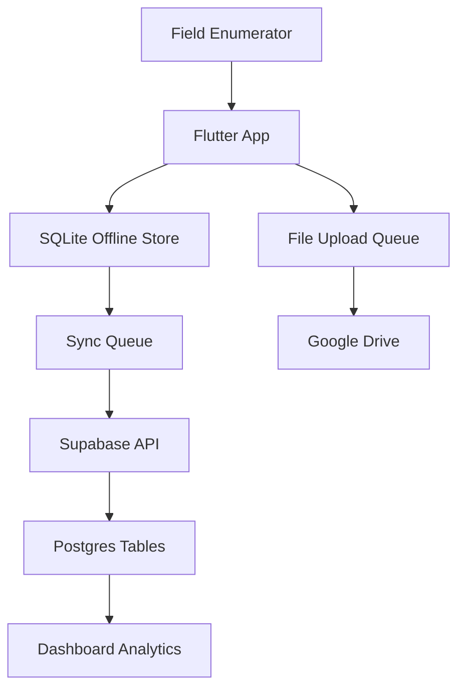
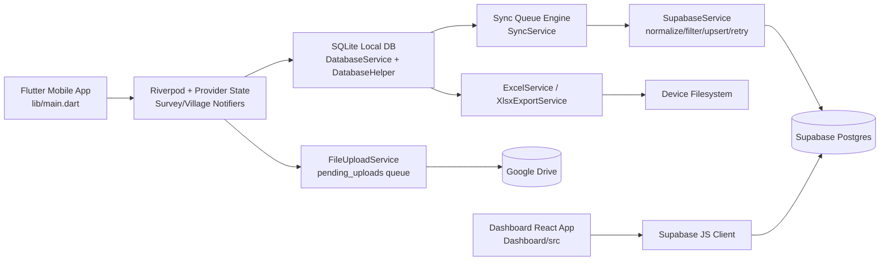
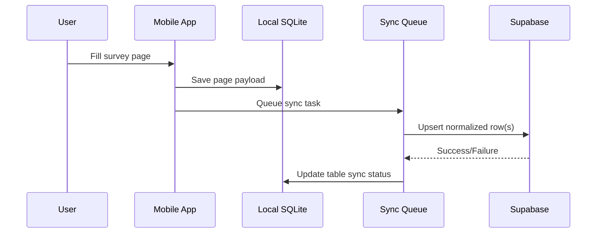

<div align="center">


# DRI SURVEY APP AND DASHBOARD

```text
██████╗ ██████╗ ██╗    ███████╗██╗   ██╗██████╗ ██╗   ██╗███████╗██╗   ██╗
██╔══██╗██╔══██╗██║    ██╔════╝██║   ██║██╔══██╗██║   ██║██╔════╝╚██╗ ██╔╝
██║  ██║██████╔╝██║    ███████╗██║   ██║██████╔╝██║   ██║█████╗   ╚████╔╝
██║  ██║██╔══██╗██║    ╚════██║██║   ██║██╔══██╗╚██╗ ██╔╝██╔══╝    ╚██╔╝
██████╔╝██║  ██║██║    ███████║╚██████╔╝██║  ██║ ╚████╔╝ ███████╗   ██║
╚═════╝ ╚═╝  ╚═╝╚═╝    ╚══════╝ ╚═════╝ ╚═╝  ╚═╝  ╚═══╝  ╚══════╝   ╚═╝
```

**Field-grade mobile survey system + cloud sync engine + admin Analytics dashboard**

</div>

> This is not a starter app. This is a full production-style rural data ecosystem designed to keep working when reality gets messy.

This repository is a complete **field data ecosystem** built for Deendayal Research Institute workflows, with:

- a Flutter mobile survey system (family + village surveys),
- an offline-first local SQLite persistence layer,
- Supabase cloud sync and auth,
- Google Drive media upload pipeline,
- XLSX/Excel export engines,
- a React + Vite admin dashboard for session-level and table-level inspection.

The codebase is engineered to survive real-world field friction: bad connectivity, schema changes, partial saves, mixed old/new keys, and long survey flows.

---

<div align="center">

```text
┌──────────────────────────────────────────────────────────────────┐
│  BUILT IN THE FIELD. TESTED BY CHAOS. DOCUMENTED LIKE A BEAST. │
└──────────────────────────────────────────────────────────────────┘
```

| Style Meter | Data Depth | Engineering Weight | Documentation Coverage |
|---|---|---|---|
| ██████████ | ██████████ | ██████████ | ██████████ |

| Visual Theme | System Mood |
|---|---|
| Terminal + Neon Cards + Engineering Atlas | Dense, confident, field-hardened |

</div>

---

## Visual Navigation

| Domain | What you get | Jump |
|---|---|---|
| Architecture | system design, flow topology, engine boundaries | [Section 2](#2-high-level-architecture) |
| Process | auth, capture, sync, upload, export, history | [Section 3](#3-system-architecture-by-process) |
| Data | keys, schema assets, migrations | [Section 4](#4-data-architecture) |
| Engineering depth | hard problems + internal mapping | [Section 5](#5-hard-problems-this-project-solves), [Section 6](#6-internal-function-mapping-core-ownership) |
| Ops & rebuild | capacity, repository blueprint, rebuild contract | [Section 8](#8-capacity-model-current-design), [Section 10](#10-rebuild-blueprint-from-this-folder-alone) |
| Exhaustive references | full file map + API/function index | [Section 13](#13-exhaustive-file-map-source-of-truth-modules), [Section 14](#14-api--function-index) |


<div align="center">

```text
╔══════════════════════════════════════════════════════════════════╗
║ CHAPTER 01 · ECOSYSTEM SNAPSHOT                                 ║
╚══════════════════════════════════════════════════════════════════╝
```

</div>

<details open>
<summary><b>Open Chapter 01 · Ecosystem Snapshot</b></summary>

## 1) Ecosystem Snapshot

### Product scope

- **Survey domains**: Family surveys and Village surveys.
- **Primary runtime**: Flutter app (`lib/`) with local durability via SQLite.
- **Cloud backend**: Supabase (auth + data tables).
- **Ops dashboard**: React/TypeScript app (`Dashboard/`) with direct Supabase reads.
- **Data outputs**: consolidated and detailed Excel/XLSX exports.
- **Media handling**: queued file uploads to Google Drive with retry when online.

### System characteristics

- Offline-first write path.
- Queue-based table sync with status tracking (`pending`, `synced`, `failed`).
- Composite key-aware upsert strategy.
- Hardcoded remote schema map to prevent runtime schema drift failures.
- Family + village table universes modeled explicitly in both mobile and dashboard layers.

---

</details>

<div align="center">

```text
╔══════════════════════════════════════════════════════════════════╗
║ CHAPTER 02 · HIGH-LEVEL ARCHITECTURE                            ║
╚══════════════════════════════════════════════════════════════════╝
```

</div>

<details open>
<summary><b>Open Chapter 02 · High-Level Architecture</b></summary>

## 2) High-Level Architecture





---

</details>

<div align="center">

```text
╔══════════════════════════════════════════════════════════════════╗
║ CHAPTER 03 · SYSTEM ARCHITECTURE BY PROCESS                     ║
╚══════════════════════════════════════════════════════════════════╝
```

</div>

<details open>
<summary><b>Open Chapter 03 · System Architecture by Process</b></summary>

## 3) System Architecture by Process



## 3.1 Auth and session bootstrap

**Entry files**: `lib/main.dart`, `lib/screens/auth/auth_screen.dart`, `lib/services/supabase_service.dart`

Flow:
1. App initializes Flutter bindings.
2. Loads env on non-web (`assets/.env`).
3. Initializes Supabase.
4. Installs core providers (`DatabaseService` always; Supabase/Sync when available).
5. Resolves initial route from auth session (`/` or `/auth`).
6. Auth screen triggers Google OAuth and routes back to landing.

Why this matters:
- The app can still boot with degraded cloud connectivity.
- Local capture is decoupled from cloud availability.
## 3.2 Family survey capture lifecycle

**Core files**: `lib/providers/survey_provider.dart`, `lib/services/database_service.dart`, `lib/services/sync_service.dart`

Flow:
1. Family pages write into provider state.
2. `saveCurrentPageData()` extracts page-specific payload.
3. Data is persisted to SQLite table(s) for that page.
4. Page completion metadata updates (`page_completion_status`, `sync_pending`).
5. Background sync trigger is initiated (non-blocking for UI).

Key architecture behavior:
- Page 0 guarantees parent session row creation.
- Child-table writes happen per page semantics.
- Sync initiation never blocks page navigation.

## 3.3 Village survey capture lifecycle

**Core files**: `lib/providers/village_survey_provider.dart`, `lib/router.dart`, `lib/screens/village_survey/*`

Flow:
1. Village form creates `session_id` + `shine_code` anchored session.
2. Screen index maps to table-specific persistence.
3. Complex screens (like social map entries) persist list rows with IDs.
4. Sync trigger runs per screen + partial survey synchronization.

Route flow is explicitly declared in `AppRouter.villageSurveyFlow` and enforced by helper navigation methods.

## 3.4 Sync engine pipeline

**Core file**: `lib/services/sync_service.dart`

Design:
- Maintains canonical family and village table lists.
- Seeds sync tracker rows for all expected tables per session.
- Enforces parent-first synchronization (session table first).
- Skips empty tables by marking them synced for progress math integrity.
- Processes queue with per-task status updates and retry behavior.
- Emits progress stream for UI status reporting.

This is one of the hardest engineering points solved here: **keeping correctness under partial local data + intermittent network + mixed table cardinalities.**

## 3.5 Supabase normalization and resilient upsert

**Core file**: `lib/services/supabase_service.dart`

Capabilities:
- Persistent session restoration.
- Retry with backoff + jitter.
- Error escalation pipeline with optional persistent logging.
- Payload normalization (booleans, numeric parsing, phone key normalization).
- Column filtering using hardcoded remote table-column maps.
- Alias resolution for known schema naming drifts.
- Composite conflict target handling for multi-key tables.

Critical outcome:
- Prevents a large class of runtime sync breakages from schema mismatch and bad-type payloads.

## 3.6 File/media upload workflow

**Core file**: `lib/services/file_upload_service.dart`

Flow:
1. Detect online/offline via `connectivity_plus`.
2. Queue pending uploads in local DB (`pending_uploads`).
3. On reconnection or timer tick, process queue.
4. Upload files into structured Google Drive folders (per SHINE code).
5. Make files readable and persist share links back to local survey data.

## 3.7 Export workflows

**Core files**: `lib/services/excel_service.dart`, `lib/services/xlsx_export_service.dart`, `lib/services/data_export_service.dart`, `lib/screens/export_screen.dart`

Supported modes:
- Single family survey export.
- Single village survey export.
- All-survey overview export.
- Summary report generation.

The export layer supports both table-oriented and consolidated presentation formats.

## 3.8 History and progress workflows

**Core files**: `lib/screens/history/history_screen.dart`, `lib/services/form_history_service.dart`

Capabilities:
- Combined family/village session timeline.
- Search, status filtering, sync trigger.
- Versioning model for form history with restore/compare semantics.

---

</details>

<div align="center">

```text
╔══════════════════════════════════════════════════════════════════╗
║ CHAPTER 04 · DATA ARCHITECTURE                                  ║
╚══════════════════════════════════════════════════════════════════╝
```

</div>

<details open>
<summary><b>Open Chapter 04 · Data Architecture</b></summary>

## 4) Data Architecture

## 4.1 Primary key strategy

- **Family root key**: `phone_number`.
- **Village root key**: `session_id` (+ `shine_code` identity semantics at business level).
- **Child table patterns**:
	- one-to-one by root key,
	- one-to-many by `(root_key, sr_no)`,
	- map-point style keys (`point_id`, etc.) where required.

## 4.2 Table ecosystem size

Family domain + village domain include dozens of structured tables (sessions, members, facilities, schemes, social indicators, agriculture, water, health, transport, mapping assets, etc.).

Canonical source files:
- `all_family_and_village_tables.md`
- `all_table_columns.txt`
- `phone_tables.txt`
- `database_supabase_sqlite/schema at supbase.sql`
- `Dashboard/schema at supbase.sql`

## 4.3 Migration and schema correction assets

Location: `database_supabase_sqlite/migrations/`

- `cleanup_duplicates_add_pks.sql`
- `fix_all_missing_pks.sql`
- `refactor_pk_sr_no.sql`

Purpose:
- remove duplicates,
- enforce PK consistency,
- align legacy structures with current sync logic.

---

</details>

<div align="center">

```text
╔══════════════════════════════════════════════════════════════════╗
║ CHAPTER 05 · HARD PROBLEMS THIS PROJECT SOLVES                  ║
╚══════════════════════════════════════════════════════════════════╝
```

</div>

<details open>
<summary><b>Open Chapter 05 · Hard Problems This Project Solves</b></summary>

## 5) Hard Problems This Project Solves

The following problems are solved in production-style code, not theory:

1. **Offline-first capture with delayed cloud durability**
	 - Local DB is the first-class source during field operations.

2. **Parent-child table sync ordering under intermittent connectivity**
	 - Parent session rows are guaranteed before child rows.

3. **Schema drift resistance**
	 - Hardcoded remote columns + payload filtering reduce runtime SQL/postgrest failures.

4. **Composite key aware upserts**
	 - Prevents duplicate child rows in one-to-many sections.

5. **Type normalization across UI/local/cloud boundaries**
	 - Booleans and numeric strings are normalized intentionally.

6. **Large multi-page survey orchestration**
	 - 30+ family pages and multi-step village forms with consistent state progression.

7. **Cross-surface visibility**
	 - Dashboard gives table-level introspection, details, and export support on top of raw sessions.

8. **Media and document attachment robustness**
	 - Upload queue + retry + link persistence to map/file-centric village workflows.

---

</details>

<div align="center">

```text
╔══════════════════════════════════════════════════════════════════╗
║ CHAPTER 06 · INTERNAL FUNCTION MAPPING                          ║
╚══════════════════════════════════════════════════════════════════╝
```

</div>

<details open>
<summary><b>Open Chapter 06 · Internal Function Mapping</b></summary>

## 6) Internal Function Mapping (Core Ownership)

## 6.1 App/runtime entry

- `lib/main.dart`
	- App bootstrap, env loading, Supabase initialization, provider wiring, initial route selection.
- `lib/router.dart`
	- Full route graph and navigation helper contracts, including village flow sequencing.

## 6.2 State controllers

- `lib/providers/survey_provider.dart`
	- Family survey page extraction, save/load orchestration, page status tracking.
- `lib/providers/village_survey_provider.dart`
	- Village session lifecycle, screen-index-to-table persistence mapping.
- `lib/providers/locale_provider.dart`, `lib/providers/font_size_provider.dart`
	- UX personalization state.

## 6.3 Persistence and sync

- `lib/database/database_helper.dart`
	- SQLite schema create/upgrade/migrate logic.
- `lib/services/database_service.dart`
	- Read/write API abstraction over SQLite tables and page/session status.
- `lib/services/sync_service.dart`
	- Queueing, parent-first dependency enforcement, task processing, sync progress stream.
- `lib/services/supabase_service.dart`
	- Auth/session persistence, payload normalization, resilient upsert, schema filtering.

## 6.4 Export and uploads

- `lib/services/excel_service.dart`
	- detailed report-style export pipelines.
- `lib/services/xlsx_export_service.dart`
	- structured XLSX generation for family/village sessions.
- `lib/services/data_export_service.dart`
	- high-level export orchestration API.
- `lib/services/file_upload_service.dart`
	- Google Drive integration with pending upload queue handling.

## 6.5 Audit/history and utility

- `lib/services/form_history_service.dart`
	- versioning, compare, restore semantics.
- `lib/screens/history/history_screen.dart`
	- session timeline + sync status UX.
- `lib/utils/bool_helper.dart`
	- bool/int normalization helpers for SQLite and UI consistency.

## 6.6 Dashboard runtime

- `Dashboard/src/services/supabase.ts`
	- Supabase client + admin user helpers.
- `Dashboard/src/services/api.ts`
	- session and related-table fetch APIs.
- `Dashboard/src/consts.ts`
	- canonical family/village table sets.
- `Dashboard/src/App.tsx`
	- section navigation, data fetch, inline details and export action.
- `Dashboard/src/components/*`
	- tabular rendering and related data views.
- `Dashboard/src/pages/*`
	- dashboard, users, family/village list/detail views.

---

</details>

<div align="center">

```text
╔══════════════════════════════════════════════════════════════════╗
║ CHAPTER 07 · WORKFLOWS (END-TO-END)                             ║
╚══════════════════════════════════════════════════════════════════╝
```

</div>

<details open>
<summary><b>Open Chapter 07 · Workflows (End-to-End)</b></summary>

## 7) Workflows (End-to-End)

## 7.1 Family survey E2E

1. Authenticated user opens family survey.
2. Page data updates provider map.
3. Save persists page payload to local table(s).
4. Page completion and pending sync flags update.
5. Sync engine queues table tasks.
6. Supabase service normalizes and upserts.
7. Sync tracker marks table states.
8. History screen displays progress and completion state.

## 7.2 Village survey E2E

1. User initializes village form with `shine_code` + `session_id`.
2. Screen-by-screen payloads save to mapped village tables.
3. Social/map-heavy screens store variable cardinality records.
4. Sync pipeline handles parent + child rows.
5. Preview/summary screens allow review before completion.

## 7.3 Dashboard inspection E2E

1. Dashboard reads session tables (`family_survey_sessions`, `village_survey_sessions`).
2. Row selection triggers parallel fetch across related tables.
3. Admin can inspect users and export session JSON artifacts.

## 7.4 Attachment workflow E2E

1. Media/document captured in mobile flow.
2. Pending upload row inserted.
3. Reconnect/timer kicks upload processor.
4. Drive file uploaded and published with share link.
5. Link stored back into local survey record.

## 7.5 Export workflow E2E

1. User chooses export scope (single/all/family/village).
2. Service fetches session + child-table data from SQLite.
3. Report writer lays out rows/sections/styles.
4. XLSX file saved to app document storage.

---

</details>

<div align="center">

```text
╔══════════════════════════════════════════════════════════════════╗
║ CHAPTER 08 · CAPACITY MODEL                                     ║
╚══════════════════════════════════════════════════════════════════╝
```

</div>

<details open>
<summary><b>Open Chapter 08 · Capacity Model</b></summary>

## 8) Capacity Model (Current Design)

```text
SYSTEM LOAD SHAPE (PRACTICAL)

Capture Layer      ████████████████████  (high tolerance)
Local Persist      ████████████████████  (very high)
Sync               █████████████████░░░  (network dependent)
```

This section is a **design-based capacity estimate**, not a synthetic benchmark report.

### Assumptions

- mobile device in mid-tier Android class,
- SQLite local-first writes,
- network intermittency expected,
- Supabase table indexes correctly aligned to PK/conflict keys,
- dashboard query limits kept bounded (default limit usage in app code).

### Expected operating envelope

- **Per device local capture**: easily supports thousands of sessions with normal field payloads before storage pressure.
- **Sync throughput**: dominated by network quality and number of unsynced child-table rows, not by UI thread.
- **Dashboard reads**: stable for session-list views and per-session detail expansion; very large account-wide scans should be paginated/server-side optimized.

### Practical scalability guidance

- Keep per-request dashboard fetch windows bounded.
- Add server-side aggregation layer if dashboard must serve heavy concurrent analytical workloads.
- Maintain PK/index hygiene across all child tables to preserve upsert performance.

---

</details>

<div align="center">

```text
╔══════════════════════════════════════════════════════════════════╗
║ CHAPTER 09 · REPOSITORY BLUEPRINT                               ║
╚══════════════════════════════════════════════════════════════════╝
```

</div>

<details open>
<summary><b>Open Chapter 09 · Repository Blueprint</b></summary>

## 9) Repository Blueprint (File-by-File)

<p>
<span style="background:#007bff;color:#fff;padding:2px 4px;border-radius:3px">🟦 Root</span>
<span style="background:#28a745;color:#fff;padding:2px 4px;border-radius:3px">🟩 Mobile</span>
<span style="background:#6f42c1;color:#fff;padding:2px 4px;border-radius:3px">🟪 Dashboard</span>
<span style="background:#fd7e14;color:#fff;padding:2px 4px;border-radius:3px">🟧 Data</span>
<span style="background:#6c757d;color:#fff;padding:2px 4px;border-radius:3px">⬜ Shells</span>
</p>

> Categories above correspond to the colorized blocks used throughout this
> section. They are meant to make scanning the repo structure easier.

### 9.1 Root-level control and reference files 🟦

- **`.env`, `.env.example`** — environment contract templates.
- **`pubspec.yaml`** — Flutter package manifest, dependencies, asset declarations.
- **`analysis_options.yaml`, `devtools_options.yaml`, `l10n.yaml`** — configuration files.
- **`all_family_and_village_tables.md`, `all_table_columns.txt`, `phone_tables.txt`** — table/schema references.
- **`supabase_all_dump.sql`, `supabase_columns.csv`, `unfilled_columns_*.csv`** — schema/audit snapshots.
- **`ff.md`** — audit and mapping notes.
- **`compare_schema_cli.sh`** — schema diff helper.
- **`delete_user_data.sql`** — targeted purge script.
- **`untranslated_keys.txt`** — i18n backlog tracker.
- **Office docs / .xlsx assets** — questionnaire templates and process notes.

### 9.2 Mobile app source (`lib/`) 🟩

#### Core
- `main.dart` — bootstrapping, provider setup, app shell.
- `router.dart` — route constants and flow transitions.
- `form_template.dart`, `table_template.dart`, `header.dart` — shared scaffolding.

#### Components (`lib/components/`)
- `autocomplete_dropdown.dart` — enhanced selection UX.
- `contextual_help.dart` — in-context user guidance.
- `enhanced_loading_indicator.dart` — loading UX layer.
- `form_validation_feedback.dart` — validation UI.
- `logo_widget.dart` — branding component.

#### Data and models
- `data/india_states_districts.dart`, `data/shine_villages.dart` — lookup datasets.
- `models/survey_models.dart` — model definitions.

#### Localization (`lib/l10n/`)
- `app_en.arb`, `app_hi.arb` — locale dictionaries.
- generated `app_localizations*.dart` classes.

#### Providers
- `providers/survey_provider.dart` — family workflow orchestrator.
- `providers/village_survey_provider.dart` — village workflow orchestrator.
- `providers/locale_provider.dart`, `providers/font_size_provider.dart` — UX state.

#### Database and services
- `database/database_helper.dart` — schema creation/migrations.
- `services/database_service.dart` — storage API.
- `services/sync_service.dart` — queue sync engine.
- `services/supabase_service.dart` — cloud abstraction.
- `services/file_upload_service.dart` — media pipeline.
- `services/form_history_service.dart` — versioning support.
- `services/excel_service.dart`, `services/xlsx_export_service.dart`, `services/data_export_service.dart` — export engines.
- `services/location_service.dart` — location utilities.
- `services/hardcoded_remote_columns.dart`, `services/hardcoded_primary_keys.dart` — schema control maps.

#### Screens
- `screens/auth/auth_screen.dart` — authentication UI.
- `screens/landing/landing_screen.dart` — main navigation hub.
- `screens/history/history_screen.dart` — survey history + sync status.
- `screens/export_screen.dart` — export actions.
- `screens/village_survey_screen.dart` — village flow launcher.

##### Family survey screens
- `screens/family_survey/survey_screen.dart` — container.
- `screens/family_survey/pages/*.dart` — all family page modules.
- `screens/family_survey/widgets/*.dart` — shared widgets.

##### Village survey screens
- `screens/village_survey/*.dart` — village form and subpages.

#### Utilities
- `utils/bool_helper.dart` — boolean helpers.
- `utils/snackbar_utils.dart` — feedback helpers.

## 9.3 Dashboard (`Dashboard/`) 🟪

### Build/runtime
- `package.json`, `vite.config.ts`, `tsconfig*.json`, `eslint.config.js` — frontend build and lint stack.
- `.env` — Supabase runtime config for dashboard.

### Source
- `src/main.tsx` — entrypoint.
- `src/App.tsx` — tabbed app shell and main table rendering.
- `src/consts.ts` — table sets.
- `src/services/supabase.ts`, `src/services/api.ts` — backend access layer.
- `src/components/*.tsx` — reusable data grid and relation viewers.
- `src/pages/*.tsx` — users/dashboard/family/village pages.
- `src/utils/exporter.ts` — export helper utilities.

### SQL and scripts
- `schema at supbase.sql`, `schema at supbase copy.sql`, `public/supbase_SCHEMA.sql` — schema references.
- `scripts/seed_family.js`, `scripts/seed_village.js` — data seeding utilities.

## 9.4 Database schema assets (`database_supabase_sqlite/`) 🟧

- `schema at supbase.sql` — master schema definition snapshot.
- `migrations/*.sql` — PK and dedup migration scripts.

## 9.5 Assets and platform shells

- `assets/` — logos, data files, app env asset.
- `android/` — native Android project and Gradle wrapper.
- `web/` — PWA/web shell assets and manifest.

## 9.6 Generated and cache-heavy folders

These exist for build/runtime artifacts and should not be treated as source-of-truth architecture:

- `build/`
- `.dart_tool/`
- `Dashboard/node_modules/`
- local Gradle cache folders

---

</details>

<div align="center">

```text
╔══════════════════════════════════════════════════════════════════╗
║ CHAPTER 10 · REBUILD BLUEPRINT                                  ║
╚══════════════════════════════════════════════════════════════════╝
```

</div>

<details open>
<summary><b>Open Chapter 10 · Rebuild Blueprint</b></summary>

## 10) Rebuild Blueprint (From This Folder Alone)

The repository already contains everything needed to reproduce the app and dashboard behavior when environment values are supplied.

### 10.1 Required environment contracts

Mobile/app side:
- `SUPABASE_URL`
- `SUPABASE_KEY`
- Google Drive credentials (if uploads are used):
	- `GOOGLE_SERVICE_ACCOUNT_EMAIL` or `GOOGLE_CLIENT_EMAIL`
	- `GOOGLE_PRIVATE_KEY`
	- optional `GOOGLE_FOLDER` / `GOOGLE_FORM`

Dashboard side:
- `VITE_SUPABASE_URL`
- `VITE_SUPABASE_SERVICE_ROLE_KEY`

### 10.2 Build/runtime truth

Mobile runtime truth:
- Flutter app writes to SQLite first, then syncs.
- Supabase schema must match table/column/key contracts used by services.

Dashboard runtime truth:
- Reads directly from Supabase with service-role privileges.
- Intended for trusted environments.

### 10.3 Schema alignment truth

Use these files as authoritative checks:
- `database_supabase_sqlite/schema at supbase.sql`
- `Dashboard/schema at supbase.sql`
- `all_table_columns.txt`
- migration scripts in `database_supabase_sqlite/migrations/`

### 10.4 Operational scripts and audit references

- `delete_user_data.sql` for controlled cleanup.
- `compare_schema_cli.sh` and `ff.md` for audit-grade validation and data-path review.

---

</details>

<div align="center">

```text
╔══════════════════════════════════════════════════════════════════╗
║ CHAPTER 11 · SECURITY AND RISK NOTES                            ║
╚══════════════════════════════════════════════════════════════════╝
```

</div>


</details>

<div align="center">

```text
╔══════════════════════════════════════════════════════════════════╗
║ CHAPTER 13 · EXHAUSTIVE FILE MAP                                ║
╚══════════════════════════════════════════════════════════════════╝
```

</div>

<details open>
<summary><b>Open Chapter 13 · Exhaustive File Map</b></summary>

## 13) Exhaustive File Map (Source-of-Truth Modules)

This appendix is the strict, rebuild-oriented file map for the active code paths and operational assets.

### 13.1 Root files

- `.env` — local env values for development/runtime.
- `.env.example` — env template contract.
- `.gitignore` — ignore policy.
- `.metadata` — Flutter tool metadata.
- `analysis_options.yaml` — lint/profile rules.
- `devtools_options.yaml` — devtools behavior.
- `l10n.yaml` — localization generation config.
- `pubspec.yaml` — dependency and asset manifest.
- `pubspec.lock` — locked dependency graph.
- `README.md` — architecture + operations documentation.
- `all_family_and_village_tables.md` — canonical table listing.
- `all_table_columns.txt` — table-column inventory.
- `phone_tables.txt` — phone-linked family table inventory.
- `ff.md` — deep audit log and gap analysis.
- `compare_schema_cli.sh` — schema comparison helper notes.
- `delete_user_data.sql` — manual cleanup SQL by surveyor identity.
- `supabase_all_dump.sql` — full DB dump snapshot.
- `supabase_columns.csv` — schema extract.
- `unfilled_columns_3233232332.csv` — audit output.
- `untranslated_keys.txt` — localization backlog.

### 13.2 Flutter app root (`lib/`)

- `main.dart` — app bootstrap, provider composition, localization/theme setup.
- `router.dart` — route constants + village flow navigation helpers.
- `form_template.dart` — reusable form scaffolding.
- `table_template.dart` — table-oriented UI template logic.
- `header.dart` — shared header scaffolding.

### 13.3 Flutter components (`lib/components/`)

- `autocomplete_dropdown.dart` — searchable dropdown with overlay list.
- `contextual_help.dart` — contextual tooltip/overlay help widgets.
- `enhanced_loading_indicator.dart` — richer loading animations.
- `form_validation_feedback.dart` — validation UI blocks.
- `logo_widget.dart` — app logo composites.

### 13.4 Flutter data + model + utils

- `data/india_states_districts.dart` — state/district lookup data.
- `data/shine_villages.dart` — SHINE village data list.
- `models/survey_models.dart` — typed survey data structures.
- `utils/bool_helper.dart` — bool/int conversion helpers.
- `utils/snackbar_utils.dart` — snackbar helper methods.

### 13.5 Localization (`lib/l10n/`)

- `app_en.arb` — English source strings.
- `app_hi.arb` — Hindi source strings.
- `app_localizations.dart` — generated localization interface.
- `app_localizations_en.dart` — generated English implementation.
- `app_localizations_hi.dart` — generated Hindi implementation.

### 13.6 Providers (`lib/providers/`)

- `survey_provider.dart` — family survey state machine + page persistence mapping.
- `village_survey_provider.dart` — village survey state machine + screen/table mapping.
- `locale_provider.dart` — locale state.
- `font_size_provider.dart` — dynamic font scaling state.

### 13.7 Database + services (`lib/database`, `lib/services`)

- `database/database_helper.dart` — SQLite create/upgrade/migration engine.
- `services/database_service.dart` — storage API for session/table CRUD + sync metadata.
- `services/sync_service.dart` — queue manager and table-level sync tracker.
- `services/supabase_service.dart` — auth, normalization, retry-upsert, schema filtering.
- `services/hardcoded_remote_columns.dart` — hardcoded remote column map.
- `services/hardcoded_primary_keys.dart` — hardcoded PK/composite-key map.
- `services/file_upload_service.dart` — pending upload queue + Google Drive operations.
- `services/location_service.dart` — location abstraction utilities.
- `services/excel_service.dart` — advanced Excel exports and report construction.
- `services/xlsx_export_service.dart` — single-session XLSX export helpers.
- `services/data_export_service.dart` — export orchestration facade.
- `services/form_history_service.dart` — form version history and restore/comparison.

### 13.8 App shell screens (`lib/screens/`)

- `screens/auth/auth_screen.dart` — Google OAuth login UX and auth handoff.
- `screens/landing/landing_screen.dart` — home launcher, language switch, survey start actions.
- `screens/history/history_screen.dart` — timeline, sync status, session filtering, manual sync trigger.
- `screens/export_screen.dart` — export mode selection and action handling.
- `screens/village_survey_screen.dart` — village survey wrapper route.

### 13.9 Family survey flow (`lib/screens/family_survey/`)

Flow container:
- `survey_screen.dart` — family page host and progression.

Pages:
- `pages/location_page.dart` — geo/location and base family session identity.
- `pages/family_details_page.dart` — family member roster capture.
- `pages/social_consciousness_page_1.dart` — social habits section A.
- `pages/social_consciousness_page_2.dart` — social habits section B.
- `pages/social_consciousness_page_3.dart` — social habits section C.
- `pages/land_holding_page.dart` — land/orchard profile.
- `pages/irrigation_page.dart` — irrigation source matrix.
- `pages/crop_productivity_page.dart` — crop-wise productivity records.
- `pages/fertilizer_page.dart` — fertilizer usage and cost.
- `pages/animals_page.dart` — livestock inventory.
- `pages/equipment_page.dart` — farm equipment and condition.
- `pages/entertainment_page.dart` — media/entertainment assets.
- `pages/transport_page.dart` — transport access.
- `pages/water_sources_page.dart` — drinking water source quality/distance.
- `pages/medical_page.dart` — treatment preference and health access.
- `pages/disputes_page.dart` — disputes and legal-status data.
- `pages/house_conditions_page.dart` — housing and sanitation conditions.
- `pages/diseases_page.dart` — disease records by family member.
- `pages/folklore_medicine_page.dart` — traditional medicine knowledge.
- `pages/health_programme_page.dart` — health program participation.
- `pages/government_schemes_page.dart` — scheme blocks and beneficiaries.
- `pages/children_page.dart` — children and malnutrition-related records.
- `pages/migration_page.dart` — migration entries.
- `pages/training_page.dart` — training and upskilling details.
- `pages/self_help_group_page.dart` — SHG data entry.
- `pages/fpo_members_page.dart` — FPO membership records.
- `pages/bank_account_page.dart` — banking inclusion records.
- `pages/pm_kisan_nidhi_page.dart` — PM Kisan Nidhi scheme.
- `pages/pm_kisan_samman_nidhi_page.dart` — PM Kisan Samman Nidhi scheme.
- `pages/kisan_credit_card_page.dart` — Kisan credit related records.
- `pages/vb_g_ram_g_beneficiary_page.dart` — VB-G-RAM-G beneficiary records.
- `pages/swachh_bharat_mission_page.dart` — SBM beneficiary records.
- `pages/fasal_bima_page.dart` — crop insurance records.
- `pages/survey_preview_page.dart` — family survey preview mode.
- `pages/family_survey_preview_page.dart` — alternate family preview screen.
- `pages/final_page.dart` — final review/submit step.

Widgets:
- `widgets/family_scheme_data_widget.dart` — reusable scheme-member table UI.
- `widgets/progress_bar.dart` — progress bar component.
- `widgets/simple_progress_bar.dart` — lightweight progress UI.
- `widgets/survey_progress_indicator.dart` — rich progress indicator.
- `widgets/survey_navigation_bar.dart` — navigation controls.
- `widgets/survey_page.dart` — page wrapper component.
- `widgets/side_navigation.dart` — family flow side nav.

### 13.10 Village survey flow (`lib/screens/village_survey/`)

- `village_form_screen.dart` — village session initialization and base details.
- `infrastructure_screen.dart` — infrastructure capture (primary).
- `infrastructure_availability_screen.dart` — infra availability details.
- `educational_facilities_screen.dart` — educational facility matrix.
- `drainage_waste_screen.dart` — drainage and waste systems.
- `irrigation_facilities_screen.dart` — village irrigation status.
- `seed_clubs_screen.dart` — seed-club details.
- `signboards_screen.dart` — signboard and notice infrastructure.
- `social_map_screen.dart` — social map entries/media.
- `survey_details_screen.dart` — meta survey detail blocks.
- `detailed_map_screen.dart` — detailed map entry/capture.
- `forest_map_screen.dart` — forest map section.
- `cadastral_map_screen.dart` — cadastral mapping section.
- `biodiversity_register_screen.dart` — biodiversity register inputs.
- `transportation_screen.dart` — transport context in village survey.
- `village_survey_preview_page.dart` — village preview before completion.
- `completion_screen.dart` — completion/finalization stage.

### 13.11 Shared survey widget path

- `screens/survey/widgets/side_navigation.dart` — shared side-navigation variant.

### 13.12 Dashboard app (`Dashboard/`)

Build/config:
- `.env` — dashboard Supabase env variables.
- `package.json`, `package-lock.json` — frontend dependency/runtime scripts.
- `vite.config.ts` — Vite build config.
- `tsconfig.json`, `tsconfig.app.json`, `tsconfig.node.json` — TS configs.
- `eslint.config.js` — lint rules.
- `index.html` — app host HTML.
- `index.css` — global styling.

Docs/assets/schema:
- `README.md` — dashboard-specific notes.
- `task_progress.md` — dashboard migration/progress notes.
- `schema at supbase.sql` — schema snapshot.
- `schema at supbase copy.sql` — schema copy snapshot.
- `public/supbase_SCHEMA.sql` — public schema reference.
- `images/*` — branding assets.
- `public/vite.svg` — default Vite icon.

Runtime source:
- `src/main.tsx` — React bootstrap.
- `src/App.tsx` — current active dashboard shell + tabs + table viewer.
- `src/consts.ts` — family/village table arrays.
- `src/services/supabase.ts` — Supabase client + user admin functions.
- `src/services/api.ts` — session and related-table fetch helpers.
- `src/utils/exporter.ts` — Excel export writer for dashboard detail objects.

Components:
- `src/components/DataTable.tsx` — server-capable DataGrid wrapper.
- `src/components/RelatedDataGrid.tsx` — dynamic tabular renderer for related rows.
- `src/components/RelatedTables.tsx` — table-by-table expansion and export for related data.
- `src/components/Layout.tsx` — legacy sidebar layout shell.

Pages:
- `src/pages/DashboardHome.tsx` — dashboard welcome summary.
- `src/pages/FamilyList.tsx` — family session list.
- `src/pages/FamilyDetails.tsx` — family session detail tabs.
- `src/pages/VillageList.tsx` — village session list.
- `src/pages/VillageDetails.tsx` — village session detail tabs.
- `src/pages/UsersPage.tsx` — user admin page (list/create/delete).
- `src/pages/SurveyPage.tsx` — placeholder page (retained for compatibility).

Scripts:
- `scripts/seed_family.js` — family seed utility.
- `scripts/seed_village.js` — village seed utility.

### 13.13 Schema and migration package (`database_supabase_sqlite/`)

- `schema at supbase.sql` — full schema baseline.
- `migrations/cleanup_duplicates_add_pks.sql` — dedup + PK reinforcement.
- `migrations/fix_all_missing_pks.sql` — PK backfill fixes.
- `migrations/refactor_pk_sr_no.sql` — `sr_no` key refactor adjustments.

### 13.14 Platform and assets

Android shell (`android/`):
- `build.gradle.kts`, `settings.gradle.kts`, `gradle.properties` — Gradle configuration.
- `app/build.gradle.kts` — app module settings.
- `app/src/main/AndroidManifest.xml` — Android manifest.
- `app/src/main/kotlin/.../MainActivity.kt` — Android entry activity.
- launcher icon assets and style XML files.
- Gradle wrapper files.

Web shell (`web/`):
- `index.html` — web host page.
- `manifest.json` — PWA metadata.
- `icons/*` — app icons.

Flutter assets (`assets/`):
- `assets/.env` — app-side env for mobile runtime.
- `assets/data/districts.json` — district lookup JSON.
- `assets/images/*` — logo and branding images.

---

</details>

<div align="center">

```text
╔══════════════════════════════════════════════════════════════════╗
║ CHAPTER 14 · API / FUNCTION INDEX                               ║
╚══════════════════════════════════════════════════════════════════╝
```

</div>

<details open>
<summary><b>Open Chapter 14 · API / Function Index</b></summary>

## 14) API / Function Index

This index is a maintainer-facing contract map for high-impact functions.

### 14.1 Mobile: survey orchestration APIs

| File | Function | Input | Output | Side effects |
|---|---|---|---|---|
| `lib/providers/survey_provider.dart` | `initializeSurvey(...)` | initial family session metadata | `Future<void>` | creates/updates family session state and local data seed |
| `lib/providers/survey_provider.dart` | `saveCurrentPageData()` | current provider state | `Future<void>` | writes page payload to SQLite and marks page completion |
| `lib/providers/survey_provider.dart` | `loadPageData([pageIndex])` | optional page index | `Future<void>` | reads from SQLite and hydrates provider state |
| `lib/providers/survey_provider.dart` | `updateSurveyDataMap(pageData)` | map of key/value updates | `void` | mutates in-memory survey state |
| `lib/providers/survey_provider.dart` | `completeSurvey()` | none | `Future<void>` | marks survey completed and triggers final sync path |
| `lib/providers/survey_provider.dart` | `loadSurveySessionForPreview(sessionId)` | family session id | `Future<void>` | builds preview-ready provider state |
| `lib/providers/survey_provider.dart` | `loadSurveySessionForContinuation(sessionId, startPage)` | session id, page | `Future<void>` | resumes partial survey flow |
| `lib/providers/survey_provider.dart` | `updateExistingSurveyEmails()` | none | `Future<void>` | backfills surveyor email on historical local records |
| `lib/providers/village_survey_provider.dart` | `initializeVillageSurvey(formData)` | session/form seed data | `Future<void>` | creates village session row and state |
| `lib/providers/village_survey_provider.dart` | `loadVillageSurvey(shineCode, editMode)` | SHINE code + mode | `Future<void>` | loads full village survey dataset |
| `lib/providers/village_survey_provider.dart` | `saveScreenData(screenIndex, data)` | screen index + payload | `Future<void>` | writes table-mapped village payload and kicks sync |
| `lib/providers/village_survey_provider.dart` | `syncPartialSurvey()` | none | `Future<void>` | submits current village session incrementally |
| `lib/providers/village_survey_provider.dart` | `completeSurvey()` | none | `Future<void>` | final village completion + sync |

### 14.2 Mobile: storage and sync APIs

| File | Function | Input | Output | Side effects |
|---|---|---|---|---|
| `lib/services/database_service.dart` | `getAllSurveySessions()` | none | `Future<List<Map<String,dynamic>>>` | reads family sessions |
| `lib/services/database_service.dart` | `getAllVillageSurveySessions()` | none | `Future<List<Map<String,dynamic>>>` | reads village sessions |
| `lib/services/database_service.dart` | `saveData(tableName, data)` | table + row map | `Future<void>` | upsert/replace into SQLite table |
| `lib/services/database_service.dart` | `insertOrUpdate(tableName, data, keyValue)` | table + row + key | `Future<void>` | keyed merge/update for village/family tables |
| `lib/services/database_service.dart` | `updateSurveySession(phoneNumber, data)` | phone + patch map | `Future<void>` | updates family session row |
| `lib/services/database_service.dart` | `updateVillageSurveySession(sessionId, data)` | session id + patch | `Future<void>` | updates village session row |
| `lib/services/database_service.dart` | `ensureSyncTable()` | none | `Future<void>` | creates sync tracker table if missing |
| `lib/services/database_service.dart` | `seedSyncTracker(referenceId, tables)` | session key + table list | `Future<void>` | pre-populates per-table sync status rows |
| `lib/services/database_service.dart` | `updateTableSyncStatus(referenceId, table, status, error?)` | sync key, table, status | `Future<void>` | updates sync state (`pending/synced/failed`) |
| `lib/services/database_service.dart` | `getTableSyncStatus(referenceId, table)` | sync key + table | `Future<String>` | reads sync status for queue decisions |
| `lib/services/sync_service.dart` | `queueSyncOperation(operation, params, highPriority)` | logical operation + payload | `Future<void>` | queue mutation and optional immediate process |
| `lib/services/sync_service.dart` | `syncAllPendingData(...)` | callbacks + priority flag | `Future<void>` | parent-first queue build/process and progress emission |
| `lib/services/sync_service.dart` | `syncFamilySurveyToSupabase(phone)` | phone | `Future<void>` | alias to full pending sync cycle |
| `lib/services/sync_service.dart` | `syncVillageSurveyToSupabase(id)` | session id | `Future<void>` | alias to full pending sync cycle |
| `lib/services/sync_service.dart` | `syncFamilyPageData(...)` | page-level payload | `Future<void>` | reserved no-op hook (currently empty impl) |
| `lib/services/sync_service.dart` | `syncVillagePageData(...)` | page-level payload | `Future<void>` | reserved no-op hook (currently empty impl) |
| `lib/services/supabase_service.dart` | `upsertNormalized(table, data)` | table + payload | `Future<void>` | remote upsert with normalization + retry |
| `lib/services/supabase_service.dart` | `ensureFamilySessionExists(phone, extra?)` | phone + optional fields | `Future<bool>` | immediate or queued remote session bootstrap |
| `lib/services/supabase_service.dart` | `syncFamilySurveyToSupabase(phone, surveyData)` | phone + survey blob | `Future<bool>` | legacy compatibility wrapper |
| `lib/services/supabase_service.dart` | `syncFamilySurveyToSupabaseWithTracking(...)` | phone + data + status map | `Future<bool>` | tracked multi-table family sync |
| `lib/services/supabase_service.dart` | `syncVillagePageToSupabase(sessionId, page, data)` | village page payload | `Future<void>` | page-scoped village upsert path |
| `lib/services/supabase_service.dart` | `syncFamilySurveyGeneric(phone, data)` | phone + family data | `Future<void>` | generic table-walk sync path |
| `lib/services/supabase_service.dart` | `syncVillageSurveyToSupabase(sessionId, data)` | session + village data | `Future<void>` | village-level generic sync path |

### 14.3 Mobile: export, history, and upload APIs

| File | Function | Input | Output | Side effects |
|---|---|---|---|---|
| `lib/services/data_export_service.dart` | `exportAllSurveysToExcel()` | none | `Future<void>` | writes aggregate workbook to filesystem |
| `lib/services/data_export_service.dart` | `exportCompleteSurveyData(phoneNumber)` | phone | `Future<void>` | writes single family survey XLSX |
| `lib/services/data_export_service.dart` | `exportCompleteVillageSurveyData(sessionId)` | session id | `Future<void>` | writes single village survey XLSX |
| `lib/services/data_export_service.dart` | `generateSurveySummaryReport()` | none | `Future<void>` | writes summary workbook |
| `lib/services/data_export_service.dart` | `exportDataAsJSON()` | none | `Future<void>` | writes lightweight backup JSON |
| `lib/services/xlsx_export_service.dart` | `exportSurveyToXlsx(sessionId, fileName)` | family session key + filename | `Future<String>` | returns saved path to generated XLSX |
| `lib/services/xlsx_export_service.dart` | `exportVillageSurveyToXlsx(sessionId, fileName)` | village session key + filename | `Future<String>` | returns saved path to generated XLSX |
| `lib/services/excel_service.dart` | `exportCompleteSurveyToExcel(phoneNumber)` | phone | `Future<void>` | full styled family report export |
| `lib/services/excel_service.dart` | `exportCompleteVillageSurveyToExcel(sessionId)` | session id | `Future<void>` | full styled village report export |
| `lib/services/excel_service.dart` | `exportAllSurveysToExcel()` | none | `Future<void>` | writes overview workbook |
| `lib/services/form_history_service.dart` | `saveFormVersion(...)` | session/form snapshot + metadata | `Future<void>` | version row insertion and current version update |
| `lib/services/form_history_service.dart` | `restoreFormVersion(...)` | target version | `Future<void>` | creates new version from historical snapshot |
| `lib/services/form_history_service.dart` | `deleteFormVersion(...)` | version key | `Future<void>` | removes versioned record |
| `lib/services/file_upload_service.dart` | `processPendingUploads()` | none | `Future<void>` | processes pending upload queue and updates links/status |

### 14.4 Dashboard APIs

| File | Function | Input | Output | Side effects |
|---|---|---|---|---|
| `Dashboard/src/services/api.ts` | `getFamilySessions()` | none | `Promise<any[]>` | reads family session table |
| `Dashboard/src/services/api.ts` | `getVillageSessions()` | none | `Promise<any[]>` | reads village session table |
| `Dashboard/src/services/api.ts` | `getFamilySessionDetails(phoneNumber)` | phone | `Promise<object>` | parallel fetch from all family related tables |
| `Dashboard/src/services/api.ts` | `getVillageSessionDetails(sessionId)` | session id | `Promise<object>` | parallel fetch from all village related tables |
| `Dashboard/src/services/supabase.ts` | `fetchTableData(table)` | table name | `Promise<any[]>` | generic table read |
| `Dashboard/src/services/supabase.ts` | `listUsers()` | none | `Promise<User[]>` | admin user listing via Supabase Auth API |
| `Dashboard/src/services/supabase.ts` | `createUser(opts)` | user payload | `Promise<User>` | admin user creation |
| `Dashboard/src/services/supabase.ts` | `deleteUser(id)` | auth user id | `Promise<void>` | admin user deletion |
| `Dashboard/src/services/supabase.ts` | `updateUser(id, opts)` | auth user id + patch | `Promise<User>` | admin user update |
| `Dashboard/src/utils/exporter.ts` | `exportToExcel(data, type)` | aggregated detail object + domain | `void` | writes multi-sheet XLSX in browser download |

### 14.5 Notes for maintainers

- Functions prefixed with `_` are intentionally internal and can change without external contract guarantees.
- `syncFamilyPageData` and `syncVillagePageData` in `SyncService` are currently placeholders; callers rely on higher-level queue sync paths.
- Dashboard service-role APIs are privileged operations; keep runtime strictly in trusted environments.

</details>

